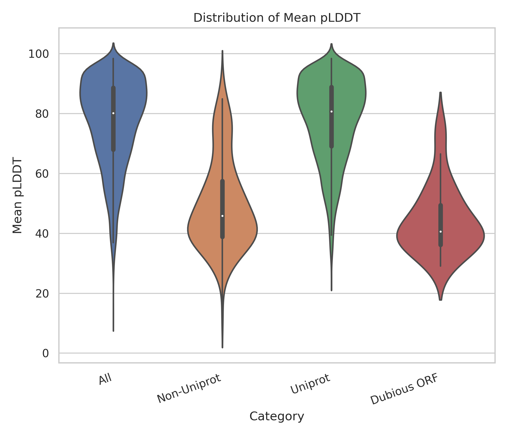

# Candida_albicans_analysis
**Structural Confidence and Sequence Characteristics of Candida albicans Proteins: A Comparative Analysis of UniProt and Non-UniProt Entries**

Shahram Mesdaghi1,2

1Institute of Systems, Molecular and Integrative Biology, University of Liverpool, Liverpool L69 7ZB, England

2Computational Biology Facility, MerseyBio, University of Liverpool, Crown Street, Liverpool L69 7ZB, U.K.

**Abstract**

Protein structure prediction plays a crucial role in understanding protein function, yet the reliability of predicted models varies depending on sequence annotation and database inclusion. Here structural confidence and sequence characteristics of Candida albicans proteins is analysed by comparing entries with and without UniProt annotations. pLDDT scores were used as a measure of structural confidence, while protein length and exon count distributions were examined to assess sequence properties. The results indicate that proteins with UniProt identifiers exhibit higher pLDDT values, suggesting greater structural reliability, while non-UniProt proteins tend to have lower confidence scores. Additionally, protein length distributions reveal that non-UniProt proteins are generally shorter than UniProt-annotated sequences, with a subset of these (labelled dubious ORFs) displaying the most restricted length range. These findings suggest that non-UniProt proteins may represent unstructured, misannotated, or novel sequences lacking homologous structural data.

**Introduction**

Protein sequence databases, including UniProtKB and FungiDB, serve as essential resources by providing curated protein annotations. However, discrepancies between these databases can lead to uncertainty in protein function prediction.

Structural bioinformatics tools, such as AlphaFold (Jumper et al., 2021) have revolutionised the field by enabling high-confidence protein structure predictions. Integrating these tools with sequence databases allows for a more comprehensive assessment of protein functional annotation reliability.

In this study, protein sequences from UniProtKB (Bateman et al., 2023) and FungiDB (Basenko et al., 2018) for C. albicans were compared, identifying mismatches between the two and assessing structural confidence of sequences that are present only in FungiDB, essentially using predicted local distance difference test (pLDDT) scores. Additionally, the reliability of non-UniProt proteins using FoldSeek and DALI was investigated to determine their structural similarity to known proteins in the Protein Data Bank (PDB). The findings set out in this document highlight the exploitation of structural validation in protein annotation and offer insights into the potential mis-annotation of certain C. albicans proteins.

**Methods**

_Data Acquisition_

The protein sequences for _Candida albicans_ were obtained from two distinct sources: UniProtKB and FungiDB. The UniProtKB protein dataset for _C. albicans_ was downloaded from the UniProt database, while the FungiDB protein dataset (version 68) for _C. albicans_ strain SC5314 was retrieved from the FungiDB website. Additionally, a mapping table linking FungiDB identifiers to UniProt identifiers (version 50) was obtained.

_Data Processing and Comparison_

All downloaded data were parsed and used to populate a Pandas DataFrame (Figure 1). To determine the overlap between the two databases, the mapping table from FungiDB was used to identify proteins that were present in both UniProtKB and FungiDB. The DataFrame was further utilised to identify proteins present in FungiDB but absent in UniProtKB by cross-referencing the protein lists from both databases. Any proteins lacking a corresponding UniProtKB entry were recorded as unique to FungiDB.

Upon inspection, the mapping file appeared incomplete, and an additional 24 UniProt identifiers were obtained from the FungiDB protein dataset (code stated in the ‘gene_product’ column) and integrated into the appropriate rows of the DataFrame.

_Structural Data Acquisition and Analysis_

For genes associated with a UniProt identifier, structural models were retrieved using the AlphaFold Database (Varadi et al., 2022) API, resulting in the download of 5,970 models. For proteins without a UniProt identifier, structural models were generated using a local installation of ColabFold (Mirdita et al., 2022). The resulting PDB files were parsed to extract the number of residues with a pLDDT > 70, as well as the mean pLDDT of the Cα atoms of each residue. All calculated values were subsequently incorporated into the Pandas DataFrame. Reports were then generated using a separate script reading in the output CSV file. Selected models of proteins generated for the non-uniprot group were screened against the PDB (Berman, 2000) using FoldSeek (van Kempen et al., 2024) and DALI (Holm, 2022).

Data availability - All code and input/output files (excluding PDB files) can be found here:

<https://github.com/mesdaghi/Candida_albicans_analysis/tree/main>

**Figure 1.** (Left) Flow chart for the construction of the Pandas data frame. (Right) Python code used to execute the construction and population of the data frame.

**Results**

The FungiDB protein dataset had **6211** entries. The data set as a whole show a mean length of 483 residues and a mean pLDDT of 77, suggesting moderate to high confidence in the predicted structures. Most proteins have a single exon (5,846 proteins), with a small number containing up to five exons. Approximately 2,991 proteins (51.2%) have at least 70% of their residues with a pLDDT above 70, indicating reliable structural predictions.

Of the 6211 entries **6033** had a uniprotID and are significantly shorter (mean length of 138 residues) and exhibit a much lower mean pLDDT of 50, indicating lower confidence in their structural predictions. Most of these proteins contain a single exon (176 out of 179), and only six meet the pLDDT > 70% threshold, highlighting their generally lower reliability. A subset of the proteins were labelled ‘Dubious Open Reading Frame’ in the ‘gene_product’ column. This set contained sequences that were significantly shorter (mean length of 112 residues) and have the lowest mean pLDDT (44), indicating poor structural reliability. All dubious ORFs have a single exon, and none meet the pLDDT > 70% threshold, suggesting that these sequences may not encode functional or well-folded proteins.

This is in contrast with proteins with UniProt identifiers which exhibit characteristics similar to the "All" category, as they comprise the majority of the dataset. They have a slightly higher mean length (494 residues) and a mean pLDDT of 78, so greater structural confidence. Their exon distribution closely matches that of the full dataset (as expected), and 2,985 proteins (51.1%) meet the pLDDT > 70% criteria (least 70% of their residues with a pLDDT above 70).

Table 1 summarises these findings.

**Table 1.**

_Summary statistics of protein categories from_ Candida albicans _datasets, including mean protein length (in residues), mean predicted Local Distance Difference Test (pLDDT) score, exon count distribution, and the number of proteins with at least 70% of residues having a pLDDT > 70. The "All" category represents the entire dataset. The "Non-UniProt" category includes proteins without a UniProt identifier. The "UniProt" category consists of proteins with a UniProt identifier. The "Dubious ORF" category includes open reading frames (ORFs) classified as dubious. Exon count distribution is presented as a dictionary, where keys indicate the number of exons and values represent the number of proteins with that exon count._

| **Category** | **Mean Protein Length** | **Mean pLDDT** | **Exon Count Distribution** | **Rows with pLDDT > 70%** |
| --- | --- | --- | --- | --- |
| **All** | 483 | 77  | {1: 5846, 2: 331, 3: 25, 4: 8, 5: 2} | 2991 |
| **Non-Uniprot** | 138 | 50  | {1: 176, 2: 1, 3: 1, 4: 1} | 6   |
| **Uniprot** | 494 | 78  | {1: 5670, 2: 330, 3: 24, 4: 7, 5: 2} | 2985 |
| **Dubious ORF** | 112 | 44  | {1: 35} | 0   |

In terms of mean pLDDT, the protein models with uniprotIDs display a broad distribution, with a peak in the high-confidence range (pLDDT > 70). They are negatively skewed indicating higher scores are favoured. Proteins lacking UniProt identifiers predominantly exhibit lower pLDDT scores, suggesting lower structural confidence. The models from sequences that have uniprotID absent show a positive skew indicating generally lower scores (Figure 2).

**Figure 2.** Histogram of mean pLDDT scores for proteins with and without UniProt identifiers. x-axis is mean pLDDT, y-axis indicates the count of proteins within each bin (5%). Proteins with UniProt identifiers are blue bars, proteins lacking UniProt identifiers are red bars.

Breaking this down further with the use of violin plots (Figure 3): proteins with UniProt identifiers tend to have higher structural confidence, while those without UniProt IDs, particularly dubious ORFs, show lower reliability in predicted structures. The "All" and "UniProt" categories exhibit similar distributions, with a large proportion of proteins having high-confidence structures (pLDDT > 70). The "Non-UniProt" and "Dubious ORF" categories display a broader spread of lower pLDDT values so lower structural confidence. Proteins in the "UniProt" category have a bimodal distribution, with a peak in the high-confidence range (80–100) and a smaller peak around 60. "Non-UniProt" proteins exhibit broader spread, with many proteins having pLDDT scores between 30 and 60, so lower structural reliability. In the "Non-UniProt" proteins group some structures may be poorly predicted or contain significant disorder (tail of violin extending toward very low pLDDT). The "Dubious ORF" category shows the lowest pLDDT scores overall, with most values clustering between 30 and 50. This shows that these sequences may correspond to unstructured or misannotated proteins, this reinforces their classification as dubious. The "UniProt" and "All" categories show a concentration of proteins at high pLDDT scores, while "Non-UniProt" and "Dubious ORF" categories are more evenly spread across the lower values. For "Non-UniProt" and "Dubious ORF" a significant fraction of them seem to be poorly predicted structures (presence of long tails in lower pLDDT ranges).

**Figure 3.** Violin plot showing the distribution of mean pLDDT scores across different protein categories. The x-axis are the protein categories: "All" (entire dataset), "Non-UniProt" (proteins without a UniProt identifier), "UniProt" (proteins with a UniProt identifier), and "Dubious ORF" (open reading frames classified as dubious). The y-axis is mean pLDDT.

In terms of protein length, the "UniProt" and "All" categories display a wide range of protein lengths, with peaks around 400 residues and long tails extending beyond 1000 residues, indicating the presence of large proteins (NB protein with lengths >3000 were omitted from the data set to prevent distortion of the plots). The "Non-UniProt" category has a more compact distribution, with most proteins below 200 residues. The "Dubious ORF" category shows a distinct distribution, with a narrow range of shorter proteins, suggesting that these sequences are predominantly small and may not correspond to full-length functional proteins. The density of distributions highlights the differences in sequence composition across categories, with UniProt proteins showing a broader length spectrum compared to non-UniProt and dubious ORF sequences (figure 4).

**Figure 4.** Violin plot showing the distribution of protein lengths across different categories, with sequences longer than 3000 residues filtered out. The x-axis represents protein categories: "All" (entire dataset), "Non-UniProt" (proteins without a UniProt identifier), "UniProt" (proteins with a UniProt identifier), and "Dubious ORF" (open reading frames classified as dubious). The y-axis represents protein length in amino acids.

Even if a sequence lacks strong homology at the sequence level (e.g., poor BLAST or HHPred hits), structural similarity can provide evidence that it belongs to a known protein family. If a predicted structure closely matches a known functional protein, it indicates that the sequence is a genuine protein-coding gene rather than an incorrect prediction. Structure-based searches can reveal relationships that standard sequence homology searches might miss. Therefore, a selection of six “non-UniProt” proteins were identified based on the number of residues with a pLDDT score above 70, aiming to minimise the impact of intrinsically disordered regions on mean pLDDT or the percentage of high-confidence residues. Three of these six proteins were labelled as "Dubious Open Reading Frames".

Since the “non-UniProt” set includes less well-curated sequences, there is a higher likelihood that some may be artifacts resulting from misannotated ORFs or incorrect predictions, such as gene prediction errors or pseudogenes.

One strategy to assess whether these sequences represent real genes is to compare their structural models against experimentally determined protein structures in databases like the PDB. To achieve this, FoldSeek was used to screen all six selected structures against the PDB.

The three structures that were not labelled "Dubious Open Reading Frames" obtained strong FoldSeek probability his against the PDB (Figure 5). All three were above 75% probability.

Figure 5. FoldSeek structural alignments of three ‘non-uniprot’ ColabFold models with their respective top PDB hit.

Generally, the predicted structures were shorter than their respective hits. This reinforces the idea that the sequences from FungiDB may be incomplete gene annotations due to errors in ORF prediction or premature stop codons in the genome assembly. The same method was used with the "Dubious Open Reading Frames" set. C1_06140_A produced several hits with the top hit having 80% probability (Figure 6 a). The remaining two models did not get a hit with FoldSeek. Although FoldSeek is extremely fast is sacrifices accuracy due, therefore, DALI was used to perform the PDB screen with the remining two models. CR_06350C_A did not get any hits with DALI but C1_12460C_A did get a number of hits with the top Z score being 5.8. Again these result show partial hits with whole structures which could indicate ORF prediction errors.

Figure 6. Structural alignments of three ‘non-uniprot’ ColabFold models with their respective top PDB hit. A) uses FoldSeek to perform the alignment and b. uses DALI.

**Discussion**

The majority of the C. albicans proteins are well-represented in both databases, Uniprot and FungiDB, although there was a subset of sequences unique to FungiDB. Structural modelling provided insights into the confidence of predicted protein structures, with UniProt-annotated proteins generally displaying higher pLDDT scores and greater lengths. In contrast, non-UniProt proteins and particularly those classified as "Dubious ORFs" exhibited lower structural confidence. This could suggest that many of these sequences may represent misannotated or incomplete gene predictions rather than functional proteins. Further structural comparisons using FoldSeek and DALI revealed that some non-UniProt proteins showed significant structural similarity to known proteins in the PDB, reinforcing their potential functional relevance supporting the notion that certain sequences in the FungiDB dataset may result from annotation errors or truncated ORFs.

There are drawbacks to the use of protein modelling used in this investigation to provide evidence that it belongs to a known protein family. Some proteins may be novel, have no homologs in PDB and this could especially apply to fungal-specific proteins. Also, modelling methods used can struggle with intrinsically disordered proteins and FoldSeek may not detect meaningful matches for highly flexible or unfolded regions and a protein appears disordered, it may still be functional but might not have a well-defined 3D structure. Additional analysis could have included evaluation of PAE scores. Low PAE scores would indicate** there were missing regions that expected in the full structure but was not included in the sequence input i.e. FoldSeek/DALI hits show strong matches to longer proteins models are shorter or if PAE is low at the potentially truncated regions  
would indicate AlphaFold expected structural continuity and so implying the input sequence is ‘cut off’ rather than naturally ending. In such cases, additional validation strategies would need to be employed. With the utilisation of a combination of strategies the combination of output data could be used with machine learning methods to make accurate predictions of whether the protein is real or not or whether min-annotation has occurred.

Basenko, E. Y., Pulman, J. A., Shanmugasundram, A., Harb, O. S., Crouch, K., Starns, D., Warrenfeltz, S., Aurrecoechea, C., Stoeckert, C. J., Kissinger, J. C., Roos, D. S., & Hertz-Fowler, C. (2018). FungiDB: An integrated bioinformatic resource for fungi and oomycetes. _Journal of Fungi_, _4_(1). <https://doi.org/10.3390/jof4010039>

Bateman, A., Martin, M.-J., Orchard, S., Magrane, M., Ahmad, S., Alpi, E., Bowler-Barnett, E. H., Britto, R., Bye-A-Jee, H., Cukura, A., Denny, P., Dogan, T., Ebenezer, T., Fan, J., Garmiri, P., da Costa Gonzales, L. J., Hatton-Ellis, E., Hussein, A., Ignatchenko, A., … Zhang, J. (2023). UniProt: the Universal Protein Knowledgebase in 2023. _Nucleic Acids Research_, _51_(D1), D523–D531. <https://doi.org/10.1093/nar/gkac1052>

Berman, H. M. (2000). The Protein Data Bank. _Nucleic Acids Research_, _28_(1), 235–242. <https://doi.org/10.1093/nar/28.1.235>

Holm, L. (2022). Dali server: structural unification of protein families. _Nucleic Acids Research_, _50_(W1). <https://doi.org/10.1093/nar/gkac387>

Jumper, J., Evans, R., Pritzel, A., Green, T., Figurnov, M., Ronneberger, O., Tunyasuvunakool, K., Bates, R., Žídek, A., Potapenko, A., Bridgland, A., Meyer, C., Kohl, S. A. A., Ballard, A. J., Cowie, A., Romera-Paredes, B., Nikolov, S., Jain, R., Adler, J., … Hassabis, D. (2021). Highly accurate protein structure prediction with AlphaFold. _Nature_, _596_(7873). <https://doi.org/10.1038/s41586-021-03819-2>

Mirdita, M., Schütze, K., Moriwaki, Y., Heo, L., Ovchinnikov, S., & Steinegger, M. (2022). ColabFold: making protein folding accessible to all. _Nature Methods_, _19_(6). <https://doi.org/10.1038/s41592-022-01488-1>

Park, H., Zhou, G., Baek, M., Baker, D., & DiMaio, F. (2021). Force Field Optimization Guided by Small Molecule Crystal Lattice Data Enables Consistent Sub-Angstrom Protein–Ligand Docking. _Journal of Chemical Theory and Computation_, _17_(3), 2000–2010. <https://doi.org/10.1021/acs.jctc.0c01184>

van Kempen, M., Kim, S. S., Tumescheit, C., Mirdita, M., Lee, J., Gilchrist, C. L. M., Söding, J., & Steinegger, M. (2024). Fast and accurate protein structure search with Foldseek. _Nature Biotechnology_, _42_(2). <https://doi.org/10.1038/s41587-023-01773-0>

Varadi, M., Anyango, S., Deshpande, M., Nair, S., Natassia, C., Yordanova, G., Yuan, D., Stroe, O., Wood, G., Laydon, A., Zídek, A., Green, T., Tunyasuvunakool, K., Petersen, S., Jumper, J., Clancy, E., Green, R., Vora, A., Lutfi, M., … Velankar, S. (2022). AlphaFold Protein Structure Database: Massively expanding the structural coverage of protein-sequence space with high-accuracy models. _Nucleic Acids Research_, _50_(D1). <https://doi.org/10.1093/nar/gkab1061>

&nbsp;

.
